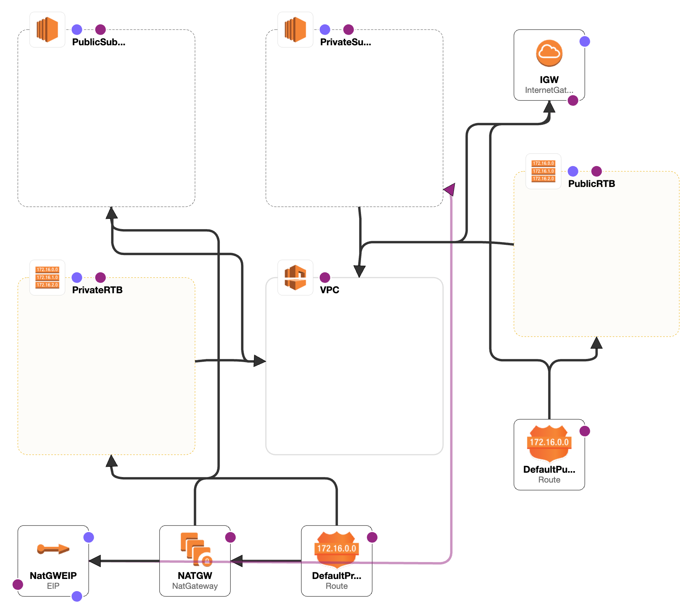

### AWS CloudFormation template for basic VPC-Subnets architecture:
<hr>

The template illustrates the basic architecture of VPC networking composed of the following AWS resources:
* VPC
* Public Subnet
* Private Subnet
* Internet Gateway and Internet Gateway Attachments
* NAT Gateway
* Route Tables

The generated architecture by the AWS designer is attached below:



#### Summary of template resources:
Resources:
  VPC:
    Type: AWS::EC2::VPC
    ...

  IGW:
    Type: AWS::EC2::InternetGateway
    ...

  IGWAttchment:
    Type: AWS::EC2::VPCGatewayAttachment
    ...

  PublicSubnet:
    Type: AWS::EC2::Subnet
    ...

  PrivateSubnet:
    Type: AWS::EC2::Subnet
    ...

  NatGWEIP:
    Type: AWS::EC2::EIP
    ...

  NATGW:
    Type: AWS::EC2::NatGateway
    ...

  PublicRTB:
    Type: AWS::Ec2::RouteTable
    ...

  DefaultPublicRoute:
    Type: AWS::EC2::Route
    ...

  PublicSubnetRTBAssociation:
    Type: AWS::EC2::SubnetRouteTableAssociation
    ...

  PrivateRTB:
    Type: AWS::EC2::RouteTable
    ...

  DefaultPrivateRoute:
    Type: AWS::EC2::Route
    ...

  PrivateSubnetRTBAssociation:
    Type: AWS::EC2::SubnetRouteTableAssociation
    ...
### Automation:

Template deployment and AWS stack creation process can be automated by taking user inputs for various parameters in the template.
For example, the values for the following VpcName and VpcCidr can be overridden by the user inputs. This process is implemented briefly in the automation.py file.
VpcName:
    Description: Name of the VPC to be created
    Type: String
    Default: test-vpc1

VpcCidr:
    Description: VPC CIDR range
    Type: String
    Default: 10.192.0.0/16
#### Override CF template parameters:


```python
import yaml


def load_aws_cf_template(template_path='vpc_basic_template.yaml'):
    """
    load aws cloud formation yaml template
    """
    with open(template_path, 'r') as stream:
        content_dict = None
        try:
            content_dict=yaml.safe_load(stream)
        except yaml.YAMLError as exc:
            content_dict = None
            print(exc)

        return content_dict


def override_values(content_dict, pair_list):
    """
    params:
        pair_list: list of key-value pair
            ex., [{'VpcName': 'value'}, ...]

    return:
        overridden template
    """
    for pair in pair_list:
        key = pair.keys()[0]
        value = pair[key]

        # validate if required key exists in template parameters section
        param_keys = content_dict['Parameters'].keys()
        if key not in param_keys: # the required key is missing in template
            print(f'{key} is missing in template parameters')
            raise Exception(f'{key} is missing in template parameters')

        # override template parameters only
        content_dict['Parameters'][key]['Default'] = value

    return content_dict


def main():
    """
    apply template override
    """
    content_dict = load_aws_cf_template()

    # set params to override
    override_params = [
        {'VpcName': 'my-vpc2'}, {'VpcCidr': '10.0.0.0/16'}
    ]
    content_dict = override_values(content_dict, override_params)


main()
```
